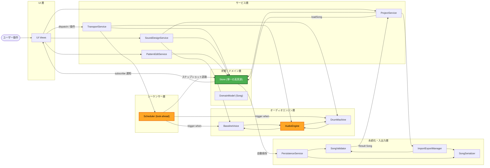

# Component Dependencies — Reversible

コンポーネント/サービス間の依存関係、通信パターン、データフロー。

## 依存マトリクス
「行 → 列」= 行が列に依存(利用)する。

| From \ To | Store | DomainModel | Scheduler | AudioEngine | Bassline | DrumMachine | Serializer | Validator | Persistence | ImportExport |
|---|---|---|---|---|---|---|---|---|---|---|
| UI Views (C-12) | ✓(購読/dispatch) | ✓(型) | — | — | — | — | — | — | — | — |
| S-01 Transport | ✓ | — | ✓ | ✓ | — | — | — | — | — | — |
| S-02 SoundDesign | ✓ | — | — | — | ✓ | ✓ | — | — | — | — |
| S-03 PatternEdit | ✓ | ✓ | — | — | — | — | — | — | — | — |
| S-04 Project | ✓ | ✓ | — | — | — | — | ✓ | ✓ | ✓ | ✓ |
| S-05 Bootstrap | ✓ | ✓ | ✓ | ✓ | ✓ | ✓ | — | — | ✓ | — |
| Scheduler (C-03) | ✓(読) | ✓(型) | — | ✓ | ✓(trigger) | ✓(trigger) | — | — | — | — |
| AudioEngine (C-04) | — | — | — | — | ✓(保持) | ✓(保持) | — | — | — | — |
| Persistence (C-10) | — | ✓ | — | — | — | — | ✓ | ✓ | — | — |
| ImportExport (C-11) | — | ✓ | — | — | — | — | ✓ | ✓ | — | — |

**依存方向の原則**: UI/サービス → Store/ドメイン → エンジン。オーディオエンジンは Store/UI に依存しない(逆流なし)。Scheduler は Store の**スナップショット読み取りのみ**(書き込みは currentStep 反映に限定)。

## 通信パターン
- **UI ⇄ 状態**: Observer(`store.subscribe`)+ 単方向 dispatch(Q4=A)。UIはpull型で再描画。
- **状態 → 音**: Scheduler が一定間隔で Store スナップショットを読み、AudioContext 時刻に発音を**先行予約**(look-ahead、push型の時刻指定)。
- **音源の抽象**: Scheduler → `Instrument.trigger` のみ(具体音源を知らない)。将来音源追加に開いている。
- **入出力**: Service → Validator の `Result` 型で成功/失敗を明示(例外を投げっぱなしにしない、SEC-15)。

## データフロー図

### Mermaid


### Text Alternative(常時掲載)
```
ユーザー操作
  -> UI Views
       - dispatch/操作 -> TransportService / SoundDesignService / PatternEditService / ProjectService
       - Store を subscribe して再描画

サービス層
  - Transport -> Store(playing/bpm) + Scheduler(start/stop/tempo) + AudioEngine(resume)
  - SoundDesign -> Store(params) + BasslineVoice/DrumMachine(setParam)
  - PatternEdit -> Store(steps)
  - Project -> Store(loadSong) + ImportExportManager + Persistence

状態・ドメイン層
  - Store(単一の真実源) -> 変更通知を UI へ / 自動保存を Persistence へ
  - Scheduler は Store のスナップショットを読み取り(pull)

シーケンサー -> オーディオ
  - Scheduler -> Instrument.trigger(event, when)  ※AudioContext時刻で先行予約
  - BasslineVoice / DrumMachine -> AudioEngine.masterOut -> 出力

永続化・入出力
  - Persistence.save/load <-> Serializer / Validator (localStorage)
  - ImportExportManager.export -> ダウンロード(サーバ非経由)
  - ImportExportManager.import(text/file) -> Validator -> Result<Song> -> Project -> Store.loadSong
```

## 循環依存の回避
- オーディオエンジン層は上位(UI/サービス/ストア)に依存しない。
- Scheduler の Store への書き込みは `setCurrentStep`(表示用)に限定し、実質は読み取り主体。
- Validator は純粋(I/Oなし)。Persistence/ImportExport が I/O を担当し、両者が Serializer/Validator を共有。
