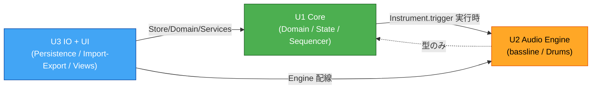

# Unit of Work Dependencies — Reversible

3ユニットの依存関係。構築順序: **U1 Core → U2 Audio Engine → U3 IO + UI**。

## 依存マトリクス
「行 → 列」= 行が列に依存する。

| From \ To | U1 Core | U2 Audio Engine | U3 IO + UI |
|---|---|---|---|
| **U1 Core** | — | ✓(実行時: `Instrument`/`AudioEngine` を注入で利用) | — |
| **U2 Audio Engine** | ✓(**型のみ**: Waveform / *Params / TriggerEvent) | — | — |
| **U3 IO + UI** | ✓(Store / Domain / サービス) | ✓(Bootstrap で Engine を配線) | — |

## 通信・依存の性質
- **U1 → U2**: 実行時依存。ただし具体音源ではなく `Instrument` 抽象に対して `trigger(event, when)` を呼ぶ(疎結合)。実体は Bootstrap(U3)で注入。
- **U2 → U1**: **型のみ**の依存(TypeScript の type-only import)。ランタイムの循環参照は発生しない。型は `src/domain/` に集約。
- **U3 → U1, U2**: 起動時の配線とユースケース調整。UIは U1 の Store を購読し、Project サービスが IO を束ねる。

## 循環回避の根拠
- ドメイン型を `domain/`(U1)に集約し、U2 は型のみ参照 → 実行時の一方向(U1 → U2)を維持。
- オーディオエンジン(U2)は状態/UIに依存しない(逆流なし)。
- IO/UI(U3)は最上位で、下位2ユニットに依存する典型的な層構造。

## ビルド/構築順序の理由
1. **U1 Core**: データモデルとストア、スケジューラは全体の土台。型も U1 に集約されるため最初に必要。
2. **U2 Audio Engine**: U1 の型を使い、実際に音を出す。U1 のスケジューラから駆動できる状態にする。
3. **U3 IO + UI**: 下位2つを配線し、保存/入出力と画面で「ユーザーが触れる」状態に仕上げる。

## 図(Mermaid)


### Text Alternative
```
U1 Core  --(実行時: Instrument.trigger)-->  U2 Audio Engine
U2 Audio Engine  --(型のみ)-->  U1 Core
U3 IO+UI  --(Store/Domain/Services)-->  U1 Core
U3 IO+UI  --(Engine 配線)-->  U2 Audio Engine
一方向の実行時依存: U1 -> U2、U3 -> U1/U2(循環なし)
```
