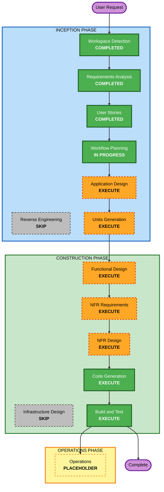

# Execution Plan — Reversible

## Detailed Analysis Summary

### Change Impact Assessment
- **User-facing changes**: Yes — 新規プロダクトのUI/操作(打ち込み、再生、音作り、入出力)すべて。
- **Structural changes**: Yes — 新規アーキテクチャをゼロから構築(オーディオエンジン / シーケンサー / 状態モデル / 永続化 / 入出力 / UI)。
- **Data model changes**: Yes — 曲/パターンのデータモデル(シリアライズ対象、バージョン付き)を新規定義。
- **API changes**: N/A(外部API/バックエンドなし。内部モジュール間インターフェースは新規)。
- **NFR impact**: Yes — リアルタイム性(グリッチ無し)、入力検証(セキュリティ)、テスト容易性(PBT)。

### Risk Assessment
- **Risk Level**: Low〜Medium
- **Rollback Complexity**: Easy(Git、クライアントのみ、外部副作用なし)
- **Testing Complexity**: Moderate(DSPの主観評価 + タイミング + シリアライズのラウンドトリップ)

## Workflow Visualization

### Mermaid Diagram



### Text Alternative(常時掲載)
```
INCEPTION PHASE
- Workspace Detection ....... COMPLETED
- Reverse Engineering ....... SKIP (greenfield)
- Requirements Analysis ..... COMPLETED
- User Stories .............. COMPLETED
- Workflow Planning ......... IN PROGRESS
- Application Design ........ EXECUTE
- Units Generation .......... EXECUTE

CONSTRUCTION PHASE (per-unit loop)
- Functional Design ......... EXECUTE
- NFR Requirements .......... EXECUTE
- NFR Design ................ EXECUTE
- Infrastructure Design ..... SKIP (no cloud/backend; static hosting)
- Code Generation ........... EXECUTE (always)
- Build and Test ............ EXECUTE (always)

OPERATIONS PHASE
- Operations ................ PLACEHOLDER
```

## Phases to Execute

### 🔵 INCEPTION PHASE
- [x] Workspace Detection (COMPLETED)
- [x] Reverse Engineering (SKIPPED — greenfield、既存コードなし)
- [x] Requirements Analysis (COMPLETED)
- [x] User Stories (COMPLETED)
- [x] Execution Plan (IN PROGRESS)
- [ ] Application Design — **EXECUTE**
  - **Rationale**: 新規コンポーネント/サービス多数(オーディオエンジン、bassline/ドラムのボイス、シーケンサー/スケジューラ、状態モデル、永続化、入出力、UI)。モジュール境界とインターフェース、ビジネスルールの定義が必要。
- [ ] Units Generation — **EXECUTE**
  - **Rationale**: システムを少数の構築可能なユニットに分解(例: サウンドエンジン / シーケンサー+状態 / 永続化+JSON入出力 / UI)。CONSTRUCTIONはユニット単位で進むため、明確な分解が有効。

### 🟢 CONSTRUCTION PHASE(ユニットごとに実行)
- [ ] Functional Design — **EXECUTE**
  - **Rationale**: 曲/パターンのデータモデル(バージョン付きスキーマ)と、複雑なロジック(シーケンサーのタイミング、アクセント/スライド、シリアライズ)を詳細設計。PBT対象プロパティ(PBT-01)もここで特定。
- [ ] NFR Requirements — **EXECUTE**
  - **Rationale**: リアルタイム性(グリッチ無し/look-aheadスケジューリング)、セキュリティ(入力検証)、技術スタック確定(TypeScript、ビルドツール、テスト、PBTフレームワーク=fast-check[PBT-09])。
- [ ] NFR Design — **EXECUTE**
  - **Rationale**: look-aheadスケジューラ、検証レイヤ、フェイルセーフなエラー処理等のNFRパターンを設計へ反映。
- [ ] Infrastructure Design — **SKIP**
  - **Rationale**: バックエンド/クラウドなし。静的アセット配信のみで、ホスティング手順は Build and Test で扱う。
- [ ] Code Generation — **EXECUTE (ALWAYS)**
  - **Rationale**: 実装計画とコード生成(ユニットごと)。
- [ ] Build and Test — **EXECUTE (ALWAYS)**
  - **Rationale**: ビルド、ユニット/PBT/統合テスト、実ブラウザでの動作確認、静的ホスティング手順。

### 🟡 OPERATIONS PHASE
- [ ] Operations — PLACEHOLDER

## Estimated Timeline
- **Total Stages to Execute**: 7(Application Design、Units Generation、Functional Design、NFR Requirements、NFR Design、Code Generation、Build and Test)
- **Skipped**: 2(Reverse Engineering、Infrastructure Design)
- **Estimated Duration**: 相対規模。MVP(bassline×1 + ドラム×1 + 16ステップ + 保存 + JSON入出力 + 機能UI)は中規模。設計→実装→テストを段階的に。

## Success Criteria
- **Primary Goal**: ブラウザで動く、オリジナルのアシッド・グルーヴボックス MVP。
- **Key Deliverables**: 動作するWebアプリ(bassline×1 + ドラム×1 + 16ステップシーケンサー + localStorage保存 + JSONエクスポート/インポート + 機能優先UI)、テスト一式(例示 + PBT)、ビルド/実行手順。
- **Quality Gates**:
  - JS-2 相当: 再生を止めずにパラメータ操作してもグリッチが出ない(NFR-1)。
  - FR-5.7 / PBT-02: エクスポート→インポートのラウンドトリップで曲状態が完全一致。
  - US-18 / SEC-05/13/15: 不正/破損JSONでもクラッシュせず安全に扱う。
